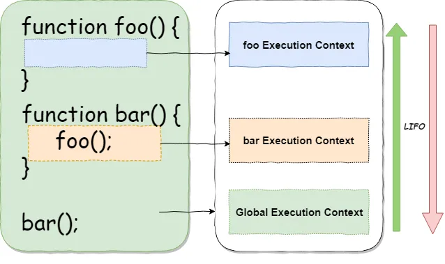
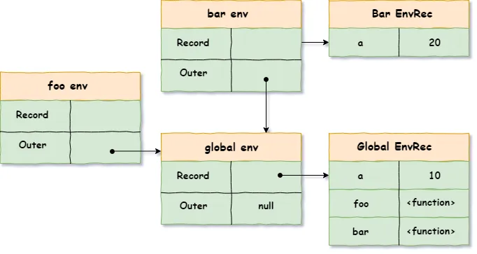
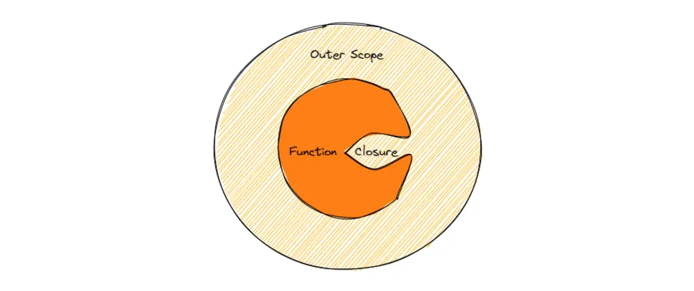

# Scopes and closure

some people said JavaScript has 2 scopes others said 3 and frankly some said 4 !!
all are right but we have to understand as in every programming language JS has two main scopes (Global, Local) and the Local scope consists of 2 other scopes (Function, Block)

so what are some uses of the scopes or why it's important to understand them
for 2 reasons in my opinion :

- for memory reasons: so you can now know when you make a variable when will it not be reachable and then the garbage collector removes it after you are done using it.

so for example if you will write a for loop like this

```js
let i = 0;
for (i = 0; i <= 10; i++) {
	console.log(i); //=> log the value of each iteration
}
console.log(i); // will log a 10
```

but if it was written like this

```js
for (let i = 0; i <= 10; i++) {
	console.log(i); //=> log the value of each iteration
}
console.log(i); // will give an error
```

why will it give an error that's because the GC did its job and removed the 'i' from the memory as soon as the block ended,
if we use var in the second case it will not be collected by the GC and will stay in the memory

- to understand more of the code security what can be accessed at the current scope and what can't it's not good to have every variable available throughout the whole app

### Global Scope

all you need to know is that variables outside a function are declared in the global scope with only one thing to keep in mind. if you used 'var' to declare a variable in the global scope it will be assigned to the window object but if you declared it with 'let' it won't be assigned to it.

```js
var a = 5;
let b = 2; // Global variable
function doSomething() {
	//Local Scope
	return a + b; //Global variable can be accessed anywhere
}

console.log(window.a); // 5
console.log(window.b); // undefined
```

### Local Scopes

there are two kinds of local scope:

#### Function Scope:

each time you create a function a new scope for it is created all the variables declared at the function are reachable by all the code inside it and as soon as it ends they are no longer accessible

we might think of many cases and questions of nesting functions and variables on different levels we will take about all this later
I just want you to know the basics about scopes first so you won't get overwhelmed

#### Block scope

was introduced with the ECMAScript6 with the let and const with it now we can declare variables in a loop and if statements using let or const only and after the block ends the variables are cleared from memory using the GC.

## Lexical Environment

The environment is an isolated area of code {} defined as a new local environment in the code and when done executing it should be removed
so what is a lexical environment? first, we have to understand the lexical scope

### Lexical scope

when we have a nested group of functions with each having its own environment if we will execute the following code:

```js
let a = 7;
let b = 10;

const multiplier = () => {
	let a = 5;
	return a * b;
};

multiplier(); // 50
```

the engine will first search in the local scope for both the variables "a & b" it will find the variable "a" in it but the variable "b" is absent so will search for it in the parent scope 'in this case the global scope' and it will use it from there.

this is called the **Scope Chain** it helps to resolve variables


when the JavaScript engine creates a new execution context for a fuction or a block it creates a lexical environment to store variables defined during the execution phase



Let’s see what happens when our code is executed as shown in the picture above:

A global execution context is created and placed at the bottom of the execution stack.
When the bar is invoked, a new bar execution context is created and put on top of the global execution context.
As bar calls to a nested function foo, a new foo execution context is created and is placed on top of the bar execution context.
When foo returns, its context is popped out of the stack, and flow returns to the bar context.
Once bar execution is finished, the flow returns back to the global context and finally, the stack is emptied.

Execution stack works on a LIFO data structure way. It waits for the topmost execution context to return before executing the context below.
each execution context has two stages:

- Creation stage: first we store the variables and arguments and the function declaration in VariableEnvironment component as initial storage "The var declared variables are initialized with the value of undefined because of hoisting". then the value of **This** is determined "LexicalEnvironment is just the copy of VariableEnvironment at this stage"

- Execution stage: values are assigned and LexicalEnvironment is used to resolve the bindings

### What is a lexical environment?

According to ECMAScript specification 262 (8.1): _A Lexical Environment is a specification type used to define the association of Identifiers to specific variables and functions based upon the lexical nesting structure of ECMAScript code_

Let’s try to simplify it A lexical environment is a data structure consists of two main components: the environment record and a reference to the outer (parent) lexical environment

so back to our scope chain example and we will try to explain the lexical environments in it

```js
let a = 7;
let b = 10;

const multiplier = () => {
	let a = 5;
	return a * b;
};
// Environment technically consists of two main components:
// environmentRecord, and a reference to the outer environment

// Environment of the global context
globalEnvironment = {
	environmentRecord: {
		// built-ins
		// our bindings:
		a: 7,
		b: 10,
	},
	outer: null, // no parent environment for the global
};

// Environment of the "multiplier" function
multiplierEnvironment = {
	environmentRecord: {
		a: 5,
	},
	outer: globalEnvironment,
};
multiplier(); // 50
```

so the process of resolving the identifier "b" in the multiplier context is called **identifier resolution** aka "Scope chain lookup" and happens on running execution context
note: the _ReferenceError_ is thrown if the identifier resolution is processed from the current environment to the outer till it reaches the global environment and the identifier is not found.

This is very similar to the prototype lookup chain

so after all this lets take a small test

```js
var a = 10;
function foo() {
	console.log(a);
}
function bar() {
	var a = 20;
	foo();
}
bar(); // will print "10"
```

Hmm why did it use the global 'a' while the nearest outer environment was the bar function environment? This is because first at creation time it captured the global 'a = 10'



## Closures



a closure is a function and the lexical environment where it was defined and by lexical in this context, we mean the parent environment
so what is magical about the closures after all it allows us to store the context of some variables even after they are removed and no longer reachable in the code.

###### So a good question here is if we can access the variable environment even after its removal where is it stored?

first, we know that we have the execution stack 'call stack' that stores each execution context which is a data structure that contains information about a function's execution environment.

It includes several components that are stored within the context :

- Variable Environment
- Scope Chain
- This value
- Parameters
- References to the outer environment "for nested functions"

okay that was almost a sum for a lot of things we said above so in the _JavaScript Var History_ article we talked about the garbage collector and the concept of reachability its the reason why the References to the outer environment is accessible even after the variable removal

why?

because the child context will still point at the value stored in the heap so the GC won't remove it


_all functions in ECMAScript are closures_ and the ones defined in the global scope outer environment reference is the global environment

```js
let x = 10;

function foo() {
  console.log(x);
}

// foo is a closure
foo: <FunctionObject> = {
  [[Call]]: <code block of foo>,
  [[Scope]]: [ //in here we store the parent environment if exist
    global: {
      x: 10
    }
  ],
  ... // other properties
};

```

in more simple pseudo code

```js
let x = 10;

function foo() {
  console.log(x); // free variable "x" == 10
}

// Closure for foo
let fooClosure = {
  code: foo // reference to function
  environment: {x: 10}, // context for searching free variables
};
```

the more the function is nested the more this code will be much complicated but I hope you got the idea
so as the function can access the parent environment will a change on it affect other functions sharing this environment as well.

the answer is YES

as we see in this code

```js
let firstClosure;
let secondClosure;

function foo() {
	let x = 1;

	firstClosure = function () {
		return ++x;
	};
	secondClosure = function () {
		return --x;
	};

	x = 2; // affection on AO["x"], which is in [[Scope]] of both closures

	console.log(firstClosure()); // 3, via firstClosure.[[Scope]]
}

foo();

console.log(firstClosure()); // 4
console.log(secondClosure()); // 3
```

closures are one of the things that allow JS to be flexible and it's one of the things that the components in frameworks rely on
it allows the creation of more encapsulated and reusable components.
Closures allow you to define private variables and functions within a component and expose only the necessary interface to the outside world

that's all for today hope you enjoyed it :)
