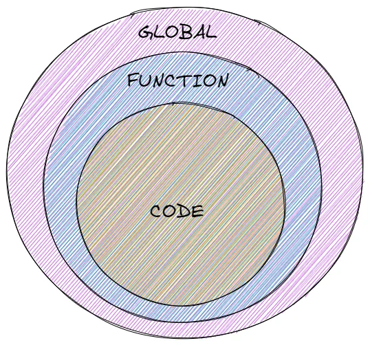

.prettierignore

# Scopes and closure

some people said JavaScript has 2 scopes others said 3 and frankly some said 4 !! all are right but we have to understand as in every programming language JS has two main scopes (Global, Local) and the Local scope consists of 2 other scopes (Function, Block) so in a more programmatically way

```js
javaScriptScopes = {
	Global,
	Local: {
		Function,
		Block,
	},
};
```

so what are some uses of the scopes or why it's important to understand them for 2 reasons in my opinion :

- for memory reasons: so you can now know when you make a variable when will it not be reachable and then the garbage collector removes it after you are done using it.

so for example if you will write a for loop like this

```js
let i = 0;
for (i = 0; i <= 10; i++) {
	console.log(i); //=> log the value of each iteration
}
console.log(i); // will log a 10
```

but if it was written like this

```js
for (let i = 0; i <= 10; i++) {
	console.log(i); //=> log the value of each iteration
}
console.log(i); // will give an error
```

why will it give an error that's because the GC did its job and removed the 'i' from the memory as soon as the block ended

if I told you if we use var in the second case it will not be collected by the GC and will stay in the memory if don't understand why check my article about the var keyword. LINK HERE

- to understand more of the code security what can be accessed at the current scope and what can't it's not good to have every variable available throughout the whole app

### Global Scope

all you need to know is that variables outside a function are declared in the global scope with only one thing to keep in mind. if you used 'var' to declare a variable in the global scope it will be assigned to the window object but if you declared it with 'let' it won't be assigned to it.

```js
var a = 5;
let b = 2; // Global variable
function doSomething() {
	//Local Scope
	return a + b; //Global variable can be accessed anywhere
}

console.log(window.a); // 5
console.log(window.b); // undefined
```

### Local Scopes

there are two kinds of local scope:

#### Function Scope:

each time you create a function a new scope for it is created all the variables declared at the function are reachable by all the code inside it and as soon as it ends they are no longer accessible

we might think of many cases and questions of nesting functions and variables on different levels we will take about all this later

I just want you to know the basics about scopes first so you won't get overwhelmed

#### Block scope

was introduced with the ECMAScript6 with the let and const with it now we can declare variables in a loop and if statements using let or const only and after the block ends the variables are cleared from memory using the GC.

## Lexical Environment

The environment is an isolated area of code {} defined a new local environment in the code and when done executing it should be removed so what is a lexical environment? first, we have to understand the lexical scope

#### Lexical scope

when we have a nested group of functions with each having its own environment if we will execute the following code:

```js
let a = 7;
let b = 10;

const multiplier = () => {
	let a = 5;
	return a * b;
};

multiplier(); // 50
```

the engine will first search in the local scope for both the variables "a & b" it will find the variable "a" in it but the variable "b" is absent so will search for it in the parent scope 'in this case the global scope' and it will use it from there.

this is called the **Scope Chain** it helps to resolve variables 




